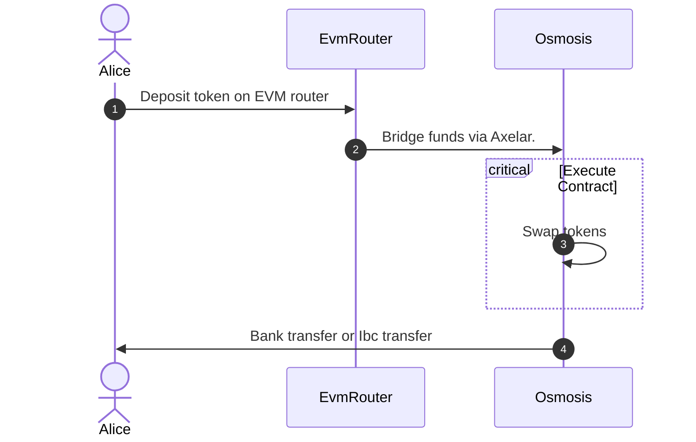
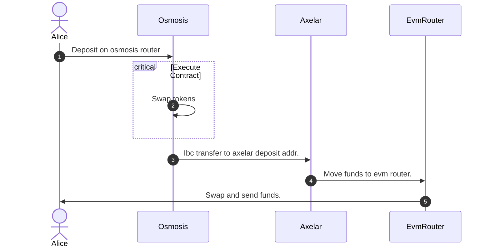

# Swing swap router on Osmosis Network

The swap router contract used for two purposes.

- Receive bridged tokens from non-cosmos chains, then swap and forward to user on osmosis or other cosmos chain via IBC transfer.
- Swap tokens on osmosis and send to axelar deposit address to bridge to non-cosmos chains.

## Instantiation

To instantiate the contract, you need to specify the following parameters:

- admin: the admin user who can register ibc channels and admin configuration.
- operator: the operator user who can execute swap and forward to recipient address on target chain.

### Example instantiation message

```json
{
  "admin": "osmo1admin",
  "operator": "osmo1operator"
}
```

## Execution

1. UpdateConfig

Update configuration(admin and operator address) by current admin user.

```sh
UpdateConfig {
    admin: Option<String>,
    operator: Option<String>,
}
```

2. SetIbcChannel

Register new ibc channel or update existing channel by admin user.

```sh
SetIbcChannel {
    chain: String,
    channel: String,
}
```

3. SwapAndForward

Operator calls this message to swap and forward to recipient address on destination chain.

```sh
SwapAndForward {
    id: String,
    input_denom: String,
    routes: Vec<SwapAmountInRoute>,
    amount: Uint128,
    min_output: Uint128,
    dest_chain: Option<String>,
    recipient: String,
}
```

`input_denom`, `routes`, `amount`, `min_output` are arguments used to send Osmosis `MsgSwapExactAmountIn` message.

`id`: Unique id per transaction. Used to prevent double swap due to backend issues.

`dest_chain`: The destination chain name. If it's null, recipient will get tokens on osmosis chain. If it's not null, the ibc channel must be registered by `SetIbcChannel` msg.

`recipient`: user address on destination chain to get swapped token.

4. Deposit

User deposits funds to swap and bridge via Axelar. The contract on destination chain(non-cosmos chain) swaps bridged token and forward to recipient address.

To allow deposit, the axelar ibc channel must be registered.

```sh
Deposit {
    input_denom: String,
    routes: Vec<SwapAmountInRoute>,
    dest_token: String,
    dest_chain: String,
    axelar_deposit_addr: String,
    recipient: String,
}
```

`input_denom`, `routes`, `min_output` are arguments used to send Osmosis `MsgSwapExactAmountIn` message.

`dest_token`: The final token address user gets on destination chain.
`dest_chain`: Name of the destination chain.
`recipient`: user address on destination chain to get swapped token.

## Examples

### Swap and forward tokens on osmosis chain.

```json
{
  "wasm": {
    "contract": "osmo1crosschainswapscontract",
    "msg": {
      "swap_and_forward": {
        "id": "1",
        "input_denom": "uosmo",
        "routes": [
          {
            "pool_id": "197",
            "token_out_denom": "ibc/52b..."
          }
        ],
        "amount": "10000000",
        "min_output": "10000",
        "recipient": "osmo1recipient"
      }
    }
  }
}
```

### Swap and forward tokens on juno network.

Requirement: juno ibc channel must be registered by `SetIbcChannel` Msg.

```json
{
  "wasm": {
    "contract": "osmo1crosschainswapscontract",
    "msg": {
      "swap_and_forward": {
        "id": "1",
        "input_denom": "uosmo",
        "routes": [
          {
            "pool_id": "197",
            "token_out_denom": "ibc/52b..."
          }
        ],
        "dest_chain": "juno",
        "amount": "10000000",
        "min_output": "10000",
        "recipient": "juno1recipient"
      }
    }
  }
}
```

### Deposit tokens to cross chain swap on non-cosmos chain.

Requirement: axelar ibc channel must be registered by `SetIbcChannel` Msg.

```json
{
  "wasm": {
    "contract": "osmo1crosschainswapscontract",
    "msg": {
      "deposit": {
        "input_denom": "uosmo",
        "routes": [
          {
            "pool_id": "197",
            "token_out_denom": "ibc/52b..."
          }
        ],
        "dest_token": "0x1234...",
        "dest_chain": "ethereum",
        "axelar_deposit_addr": "axelar1depositaddr",
        "recipient": "0x3234..."
      }
    }
  }
}
```

## Flow

### Swap and forward



### Deposit


